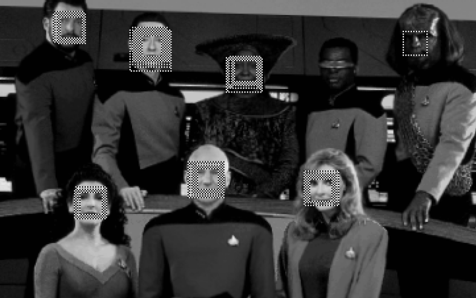
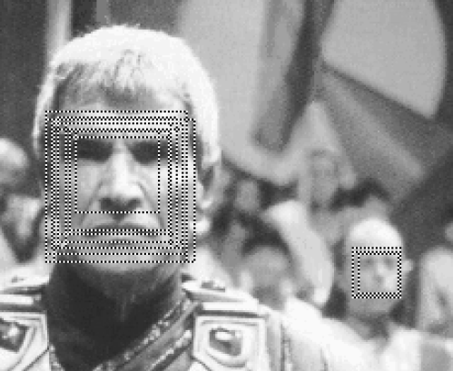
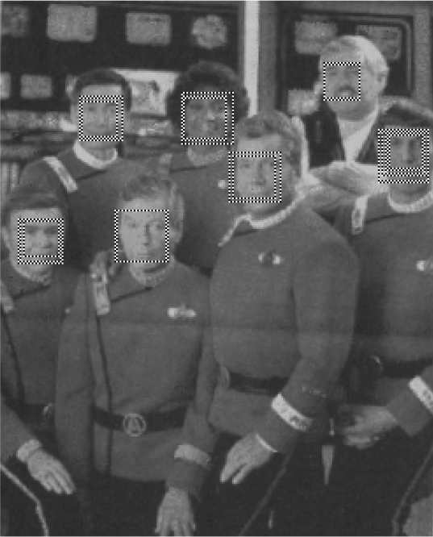
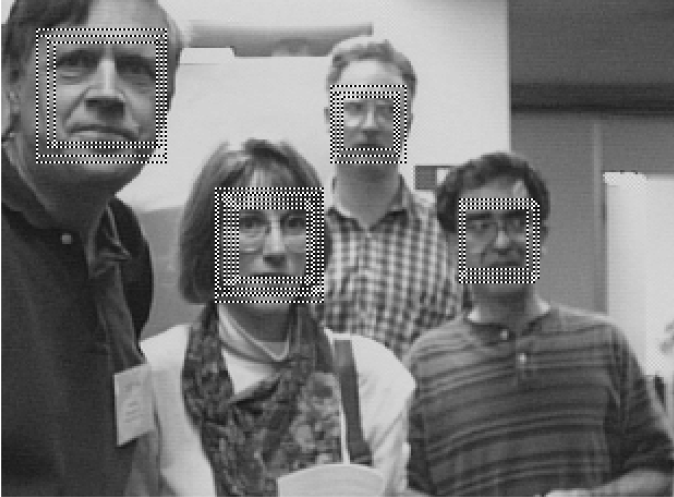

## Facial Keypoint Detection
### Case Study, Kaggle Competition


### Sai Kiran Vadhi

---

## Contents

- Introduction & Data Exploration
- Gaussian Clustering Algorithm
- Random Forest
- Support Vector Machines
- Output (Predictions)

--- &vertical

## Introduction

- **Facial Keypoint Detection** is an online data mining competition organised by [Kaggle](https://www.kaggle.com/c/facial-keypoints-detection).

- The goal of the competition is to locate specific keypoints on face images.

***

### Introduction & Data Exploration

- Kaggle has provided the competitors with ***train.csv*** and ***test.csv*** for the competition.

***

### Train.csv

```{r Loading_Rdata, echo=FALSE, message=FALSE}
load("C:/Users/saikiran.vadhi/Documents/R_Working_Directory/Experiment_continues_130901_continues_130924/.RData")
library(png)
library(grid)
```

```{r Training_data_rows, message=FALSE}
nrow(training_full_data)
```

```{r Training_data_columns, message=FALSE}
ncol(training_full_data)
```

***

### Train.csv

```{r Training_data_colnames, message=FALSE}
colnames(training_full_data)
```

***

### Train.csv

```{r Training_data_structure, message=FALSE}
str(training_full_data)
```

***

### Test.csv

```{r Testing_data_rows, message=FALSE}
nrow(test_full_data)
```

```{r Testing_data_columns, message=FALSE}
ncol(test_full_data)
```

***

### Test.csv

```{r Testing_data_summary, message=FALSE}
summary(test_full_data)
```

***

### Training Image Data

```{r Image_data_rows, message=FALSE}
nrow(training_image_data)
```

```{r Image_data_columns, message=FALSE}
ncol(training_image_data)
```

* Where each of the 9216 characters in each row,   
  represent the grayscale intensity of each pixel in an image.
* So they represent 96x96 (=9216) grayscale image.

---&vertical

## Some Example Images

***

### Some Example Images (1/5)
```{r fig.width=7, fig.height=7, echo=FALSE}
img <- readPNG("./figure/Rplot_train_1.png")
 grid.raster(img)
```

***

### Some Example Images (2/5)
```{r fig.width=7, fig.height=7, echo=FALSE}
img <- readPNG("./figure/Rplot_train_2.png")
 grid.raster(img)
```

***

### Some Example Images (3/5)
```{r fig.width=7, fig.height=7, echo=FALSE}
img <- readPNG("./figure/Rplot_train_3.png")
 grid.raster(img)
```

***

### Some Example Images (4/5)
```{r fig.width=7, fig.height=7, echo=FALSE}
img <- readPNG("./figure/Rplot_train_4.png")
 grid.raster(img)
```

***

### Some Example Images (5/5)
```{r fig.width=7, fig.height=7, echo=FALSE}
img <- readPNG("./figure/Rplot_train_5.png")
 grid.raster(img)
```

***

### Legend
```{r fig.width=7, fig.height=7, echo=FALSE}
img <- readPNG("./figure/Legend.png")
 grid.raster(img)
```

---&vertical

### What is to be done?
From the given data of images and the keypoints of the respecitive images,  
we should predict the keypoints for the images in the test set.

***

### Submission.csv
- For the purpose of making a submission file, another file called _submission.csv_ is provided.
- This contains the image id of the images and the points to be predicted for each image.
- Observation from this file:
  1. Not all the images need all the keypoints
  2. Some need only 4 of the 15 keypoints

---&vertical

### Initial approaches

- Initially I tried creating and using some filters which used to modify the image, like:  
  1. Differentiation Filter
  2. Contrast Filter

***

### Normal Image
```{r fig.width=7, fig.height=7, echo=FALSE}
img <- readPNG("./figure/test_image_1.png")
 grid.raster(img)
```

***

### Differentiation Filter
```{r fig.width=7, fig.height=7, echo=FALSE}
img <- readPNG("./figure/test_image_diff_1.png")
 grid.raster(img)
```

***

### Contrast Filter
```{r fig.width=7, fig.height=7, echo=FALSE}
img <- readPNG("./figure/test_image_sharp_1.png")
 grid.raster(img)
```

---&vertical

## Gaussian Clustering Algorithm

Need for choosing this method:  
- We need to look at how presently pattern detection is done in:
  1. Color images
  2. Videos
  
***

### In color images
```{r fig.width=8, fig.height=6, echo=FALSE}
img <- readPNG("./figure/color_image_example.png")
 grid.raster(img)
```
- Human skin tone is located on a very narrow region on the chromatic scale.

***

### In Videos
- In videos also, skin tone detection method can be used if the capturing device is capable of producing colors.
- and if it is in grayscale: motion in the video can be used for detection.

***

### The challenge
- In our case,  
there is neither color to detect the skin tone,  
nor motion to detect the change in image space.
- So, there was a need to implement a new algorithm which would detect patterns much more efficiently.

***

### Gaussian Clustering Algorithm

- This kind of pattern detection using Gaussian Clusters was first proposed by __KK Sung__ in his paper: [Example-Based Learning for View-Based Human Face Detection](http://www.cse.iitb.ac.in/~naveen/MTP/ExampleBasedFaceRecognition.pdf)
- One of the renowned paper in the field of gray scale image pattern detection with __1948 citations__ till date.

***

### Gaussian Clustering Algorithm

- The main advantage of this approach will be explained through the following figures:
```{r fig.width=7, fig.height=7, echo=FALSE}
img <- readPNG("./figure/test_image_1.png")
 grid.raster(img)
```

***

```{r fig.width=7, fig.height=7, echo=FALSE}
img <- readPNG("./figure/sung_example.png")
 grid.raster(img)
```

---

### Gaussian Clustering Algorithm
- We take a database of face images of a specified dimension.
- Each pixel of the image acts one dimension  
so with 25x25 dimension images, we have a 625 dimensional space.
- We project each face image into this image space.
- So, each 25x25 image will be a point in the 625 dimensional space.
- After plotting all face images,  
we choose _k_ number of clusters to be present in the space.
- Then finally, we try to fit _k_ Gaussian clusters upon these 6 clusters that are formed.

---&vertical

### Pre-processing
- The images that are being used for training need to be pre-processed for maintaining uniformity:
  1. Image resizing
  2. Masking
  3. Histogram Equalization

***

### Image resizing
```{r fig.width=7, fig.height=7, echo=FALSE}
img <- readPNG("./figure/image_1.png")
 grid.raster(img)
```

***

### Masking
```{r fig.width=7, fig.height=7, echo=FALSE}
img <- readPNG("./figure/masked_original_to_masked.png")
 grid.raster(img)
```

***

### Histogram Equalization
```{r fig.width=7, fig.height=7, echo=FALSE}
img <- readPNG("./figure/masked_to_histo_equal.png")
 grid.raster(img)
```

---&vertical

### Gaussian Clustering
As mentioned previously:
- These pre-processed images are projected onto the images space and _k_ clusters are formed.
```{r fig.width=7, fig.height=4, echo=FALSE}
img <- readPNG("./figure/gaussian_clusters_1.png")
 grid.raster(img)
```
- We fit _k_ Gaussians over these _k_ clusters.

***

### Gaussian Clustering

- One of the important factor that determines the clustering is the distance measure used.  
- It is called __Mahalanobis Distance__:

- In Gaussian clustering, _Mahalanobis distance_ is used in place of normal _Euclidian distance_.

***

### Challenge Faced

- When we see the above Mahalanobis distance metric, the __det inverse__ which needs to be calculated is causing the problem for the formation of clusters.
- Even if the determinant is tending to ___0___, instead of absolute 0, ___R___ is considering it to be 0, because of which formation of Gaussian clusters is not possible.
- This is the crucial step in this Gaussian Clustering method.
- I have tried the __determinant__ function of other packages, which were also of not much help.
- So, I had to look out for other methods.

---

### Looking forward to other methods
  1. Random Forest
  2. Support Vector Machines

---

## Principal Component Analysis
- A crucial step.
- Provided computers with only _4 GB_ of memory, and platforms like R, there was always:  
_**Error!** Could not allocate enough memory._
- So, the number of dimensions which were to be analyzed, had to be reduced by considerable amount.
- PCA was the clear cut solution to this problem.
- In my case, I was able to reduce 9216 dimensions to 150 while retaining more than __90%__ of the data.

---&vertical

## Random Forest
- After PCA i.e. reducing the dimensions by considerable amount, I trained the data with random forest.
- An error occured: _**Error!** NA's not permitted_
- So, replaced all missing values in training data set with the mean data of each column.
- And this model was used to predict the keypoints in test data.
- This fetched me an RMSE score of 4.4

***

## Random Forest
- I used Random Forest on a slightly different data where the data with no NA's (2140 rows) was considered.
- Applying the previously mentioned procedure fetched me an RMSE score of 4.2

---

## SVM
- To find a better regression analysis of the data, _Support Vector Machines_ were chosen.
- Since multivariate SVM was not present, I trained 30 models for each class variable and predicted them.
- This fetched me an __RMSE__ score of _3.595_ and current standing in Kaggle leaderboard is ___21___ (as on _22nd Oct '13_).

---&vertical

## Some Output Predictions

***

### Output Predictions (1/5)
```{r fig.width=7, fig.height=7, echo=FALSE}
img <- readPNG("./figure/Rplot1.png")
 grid.raster(img)
```

***

### Output Predictions (2/5)
```{r fig.width=7, fig.height=7, echo=FALSE}
img <- readPNG("./figure/Rplot2.png")
 grid.raster(img)
```

***

### Output Predictions (3/5)
```{r fig.width=7, fig.height=7, echo=FALSE}
img <- readPNG("./figure/Rplot3.png")
 grid.raster(img)
```

***

### Output Predictions (4/5)
```{r fig.width=7, fig.height=7, echo=FALSE}
img <- readPNG("./figure/Rplot4.png")
 grid.raster(img)
```

***

### Output Predictions (5/5)
```{r fig.width=7, fig.height=7, echo=FALSE}
img <- readPNG("./figure/Rplot5.png")
 grid.raster(img)
```

***

### Legend
```{r fig.width=7, fig.height=7, echo=FALSE}
img <- readPNG("./figure/Legend.png")
 grid.raster(img)
```

---

### Conclusion
- Though Gaussian Clustering method was lengthy and cumbersome, its completed implementation would have helped to achieve much better results.
- Due to lack of time, I had to turn to SVM which also worked well when compared to other regressions like random forest.

---&vertical



***



***



***

