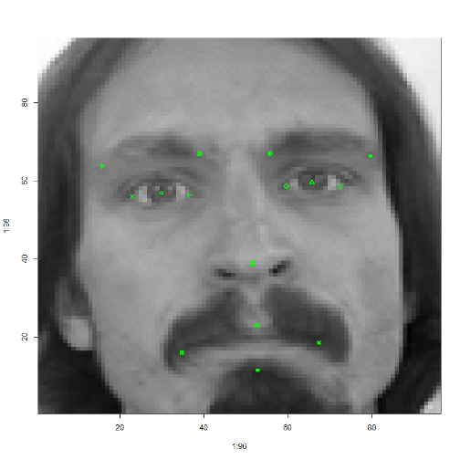
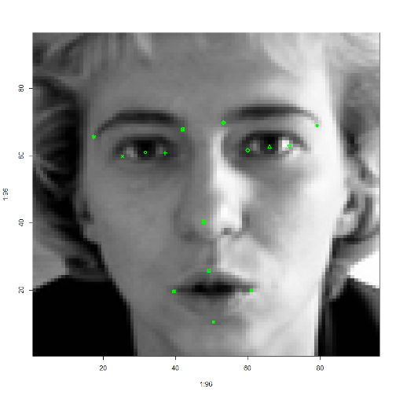
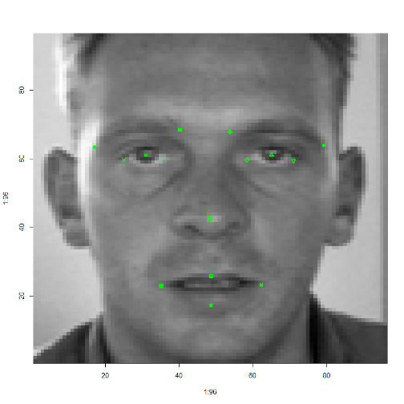
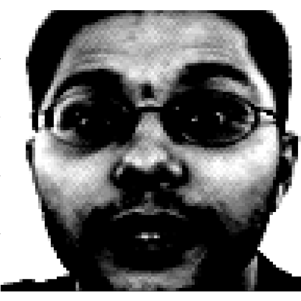
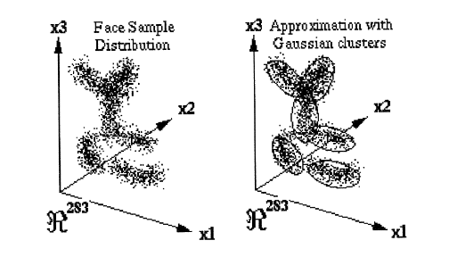
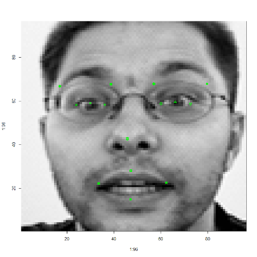
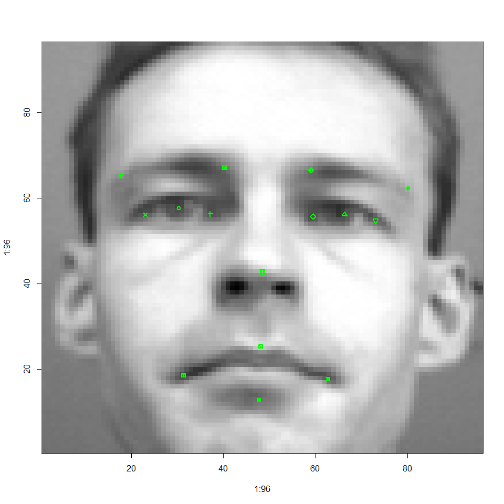

## Facial Keypoint Detection
### Case Study, Kaggle Competition


### Sai Kiran Vadhi

---

## Contents

- Introduction & Data Exploration
- Gaussian Clustering Algorithm
- Random Forest
- Support Vector Machines
- Output (Predictions)

--- &vertical

## Introduction

- **Facial Keypoint Detection** is an online data mining competition organised by [Kaggle](https://www.kaggle.com/c/facial-keypoints-detection).

- The goal of the competition is to locate specific keypoints on face images.

***

### Introduction & Data Exploration

- Kaggle has provided the competitors with ***train.csv*** and ***test.csv*** for the competition.

***

### Train.csv


```r
nrow(training_full_data)
```

```
## [1] 7049
```


```r
ncol(training_full_data)
```

```
## [1] 30
```


***

### Train.csv


```r
colnames(training_full_data)
```

```
##  [1] "left_eye_center_x"         "left_eye_center_y"        
##  [3] "right_eye_center_x"        "right_eye_center_y"       
##  [5] "left_eye_inner_corner_x"   "left_eye_inner_corner_y"  
##  [7] "left_eye_outer_corner_x"   "left_eye_outer_corner_y"  
##  [9] "right_eye_inner_corner_x"  "right_eye_inner_corner_y" 
## [11] "right_eye_outer_corner_x"  "right_eye_outer_corner_y" 
## [13] "left_eyebrow_inner_end_x"  "left_eyebrow_inner_end_y" 
## [15] "left_eyebrow_outer_end_x"  "left_eyebrow_outer_end_y" 
## [17] "right_eyebrow_inner_end_x" "right_eyebrow_inner_end_y"
## [19] "right_eyebrow_outer_end_x" "right_eyebrow_outer_end_y"
## [21] "nose_tip_x"                "nose_tip_y"               
## [23] "mouth_left_corner_x"       "mouth_left_corner_y"      
## [25] "mouth_right_corner_x"      "mouth_right_corner_y"     
## [27] "mouth_center_top_lip_x"    "mouth_center_top_lip_y"   
## [29] "mouth_center_bottom_lip_x" "mouth_center_bottom_lip_y"
```


***

### Train.csv


```r
str(training_full_data)
```

```
## 'data.frame':	7049 obs. of  30 variables:
##  $ left_eye_center_x        : num  66 64.3 65.1 65.2 66.7 ...
##  $ left_eye_center_y        : num  39 35 34.9 37.3 39.6 ...
##  $ right_eye_center_x       : num  30.2 29.9 30.9 32 32.2 ...
##  $ right_eye_center_y       : num  36.4 33.4 34.9 37.3 38 ...
##  $ left_eye_inner_corner_x  : num  59.6 58.9 59.4 60 58.6 ...
##  $ left_eye_inner_corner_y  : num  39.6 35.3 36.3 39.1 39.6 ...
##  $ left_eye_outer_corner_x  : num  73.1 70.7 71 72.3 72.5 ...
##  $ left_eye_outer_corner_y  : num  40 36.2 36.3 38.4 39.9 ...
##  $ right_eye_inner_corner_x : num  36.4 36 37.7 37.6 37 ...
##  $ right_eye_inner_corner_y : num  37.4 34.4 36.3 38.8 39.1 ...
##  $ right_eye_outer_corner_x : num  23.5 24.5 25 25.3 22.5 ...
##  $ right_eye_outer_corner_y : num  37.4 33.1 36.6 38 38.3 ...
##  $ left_eyebrow_inner_end_x : num  57 54 55.7 56.4 57.2 ...
##  $ left_eyebrow_inner_end_y : num  29 28.3 27.6 30.9 30.7 ...
##  $ left_eyebrow_outer_end_x : num  80.2 78.6 78.9 77.9 77.8 ...
##  $ left_eyebrow_outer_end_y : num  32.2 30.4 32.7 31.7 31.7 ...
##  $ right_eyebrow_inner_end_x: num  40.2 42.7 42.2 41.7 38 ...
##  $ right_eyebrow_inner_end_y: num  29 26.1 28.1 31 30.9 ...
##  $ right_eyebrow_outer_end_x: num  16.4 16.9 16.8 20.5 15.9 ...
##  $ right_eyebrow_outer_end_y: num  29.6 27.1 32.1 29.9 30.7 ...
##  $ nose_tip_x               : num  44.4 48.2 47.6 51.9 43.3 ...
##  $ nose_tip_y               : num  57.1 55.7 53.5 54.2 64.9 ...
##  $ mouth_left_corner_x      : num  61.2 56.4 60.8 65.6 60.7 ...
##  $ mouth_left_corner_y      : num  80 76.4 73 72.7 77.5 ...
##  $ mouth_right_corner_x     : num  28.6 35.1 33.7 37.2 31.2 ...
##  $ mouth_right_corner_y     : num  77.4 76 72.7 74.2 77 ...
##  $ mouth_center_top_lip_x   : num  43.3 46.7 47.3 50.3 45 ...
##  $ mouth_center_top_lip_y   : num  72.9 70.3 70.2 70.1 73.7 ...
##  $ mouth_center_bottom_lip_x: num  43.1 45.5 47.3 51.6 44.2 ...
##  $ mouth_center_bottom_lip_y: num  84.5 85.5 78.7 78.3 86.9 ...
```


***

### Test.csv


```r
nrow(test_full_data)
```

```
## [1] 1783
```


```r
ncol(test_full_data)
```

```
## [1] 2
```


***

### Test.csv


```r
summary(test_full_data)
```

```
##     ImageId        Image          
##  Min.   :   1   Length:1783       
##  1st Qu.: 446   Class :character  
##  Median : 892   Mode  :character  
##  Mean   : 892                     
##  3rd Qu.:1338                     
##  Max.   :1783
```


***

### Training Image Data


```r
nrow(training_image_data)
```

```
## [1] 7049
```


```r
ncol(training_image_data)
```

```
## [1] 9216
```


* Where each of the 9216 characters in each row,   
  represent the grayscale intensity of each pixel in an image.
* So they represent 96x96 (=9216) grayscale image.

---&vertical

## Some Example Images

***

### Some Example Images (1/5)
 


***

### Some Example Images (2/5)
 


***

### Some Example Images (3/5)
 


***

### Some Example Images (4/5)
 


***

### Some Example Images (5/5)
 


***

### Legend
 


---&vertical

### What is to be done?
From the given data of images and the keypoints of the respecitive images,  
we should predict the keypoints for the images in the test set.

***

### Submission.csv
- For the purpose of making a submission file, another file called _submission.csv_ is provided.
- This contains the image id of the images and the points to be predicted for each image.
- Observation from this file:
  1. Not all the images need all the keypoints
  2. Some need only 4 of the 15 keypoints

---&vertical

### Initial approaches

- Initially I tried creating and using some filters which used to modify the image, like:  
  1. Differentiation Filter
  2. Contrast Filter

***

### Normal Image
 


***

### Differentiation Filter
 


***

### Contrast Filter
 


---&vertical

## Gaussian Clustering Algorithm

Need for choosing this method:  
- We need to look at how presently pattern detection is done in:
  1. Color images
  2. Videos
  
***

### In color images
 

- Human skin tone is located on a very narrow region on the chromatic scale.

***

### In Videos
- In videos also, skin tone detection method can be used if the capturing device is capable of producing colors.
- and if it is in grayscale: motion in the video can be used for detection.

***

### The challenge
- In our case,  
there is neither color to detect the skin tone,  
nor motion to detect the change in image space.
- So, there was a need to implement a new algorithm which would detect patterns much more efficiently.

***

### Gaussian Clustering Algorithm

- This kind of pattern detection using Gaussian Clusters was first proposed by __KK Sung__ in his paper: [Example-Based Learning for View-Based Human Face Detection](http://www.cse.iitb.ac.in/~naveen/MTP/ExampleBasedFaceRecognition.pdf)
- One of the renowned paper in the field of gray scale image pattern detection with __1948 citations__ till date.

***

### Gaussian Clustering Algorithm

- The main advantage of this approach will be explained through the following figures:
 


***

 


---

### Gaussian Clustering Algorithm
- We take a database of face images of a specified dimension.
- Each pixel of the image acts one dimension  
so with 25x25 dimension images, we have a 625 dimensional space.
- We project each face image into this image space.
- So, each 25x25 image will be a point in the 625 dimensional space.
- After plotting all face images,  
we choose _k_ number of clusters to be present in the space.
- Then finally, we try to fit _k_ Gaussian clusters upon these 6 clusters that are formed.

---&vertical

### Pre-processing
- The images that are being used for training need to be pre-processed for maintaining uniformity:
  1. Image resizing
  2. Masking
  3. Histogram Equalization

***

### Image resizing
 


***

### Masking
 


***

### Histogram Equalization
 


---&vertical

### Gaussian Clustering
As mentioned previously:
- These pre-processed images are projected onto the images space and _k_ clusters are formed.
 

- We fit _k_ Gaussians over these _k_ clusters.

***

### Gaussian Clustering

- One of the important factor that determines the clustering is the distance measure used.  
- It is called __Mahalanobis Distance__:

- In Gaussian clustering, _Mahalanobis distance_ is used in place of normal _Euclidian distance_.

***

### Challenge Faced

- When we see the above Mahalanobis distance metric, the __det inverse__ which needs to be calculated is causing the problem for the formation of clusters.
- Even if the determinant is tending to ___0___, instead of absolute 0, ___R___ is considering it to be 0, because of which formation of Gaussian clusters is not possible.
- This is the crucial step in this Gaussian Clustering method.
- I have tried the __determinant__ function of other packages, which were also of not much help.
- So, I had to look out for other methods.

---

### Looking forward to other methods
  1. Random Forest
  2. Support Vector Machines

---

## Principal Component Analysis
- A crucial step.
- Provided computers with only _4 GB_ of memory, and platforms like R, there was always:  
_**Error!** Could not allocate enough memory._
- So, the number of dimensions which were to be analyzed, had to be reduced by considerable amount.
- PCA was the clear cut solution to this problem.
- In my case, I was able to reduce 9216 dimensions to 150 while retaining more than __90%__ of the data.

---&vertical

## Random Forest
- After PCA i.e. reducing the dimensions by considerable amount, I trained the data with random forest.
- An error occured: _**Error!** NA's not permitted_
- So, replaced all missing values in training data set with the mean data of each column.
- And this model was used to predict the keypoints in test data.
- This fetched me an RMSE score of 4.4

***

## Random Forest
- I used Random Forest on a slightly different data where the data with no NA's (2140 rows) was considered.
- Applying the previously mentioned procedure fetched me an RMSE score of 4.2

---

## SVM
- To find a better regression analysis of the data, _Support Vector Machines_ were chosen.
- Since multivariate SVM was not present, I trained 30 models for each class variable and predicted them.
- This fetched me an __RMSE__ score of _3.595_ and current standing in Kaggle leaderboard is ___21___ (as on _22nd Oct '13_).

---&vertical

## Some Output Predictions

***

### Output Predictions (1/5)
 


***

### Output Predictions (2/5)
 


***

### Output Predictions (3/5)
 


***

### Output Predictions (4/5)
 


***

### Output Predictions (5/5)
 


***

### Legend
 


---

### Conclusion
- Though Gaussian Clustering method was lengthy and cumbersome, its completed implementation would have helped to achieve much better results.
- Due to lack of time, I had to turn to SVM which also worked well when compared to other regressions like random forest.

---&vertical


***


***


***


